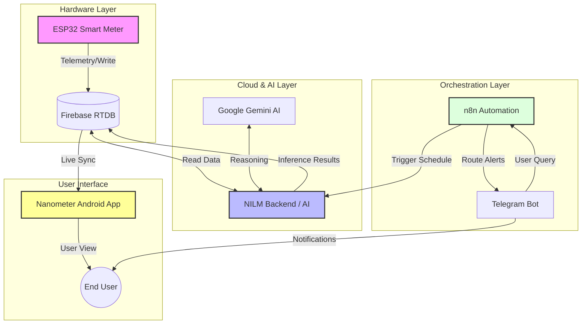

# ⚡ Voltra Ecosystem
**The AI-Native Smart Energy & NILM Solution (2025–2026)**

<div align="center">
  
</div>

## 📖 Project Overview

Voltra is a comprehensive, end-to-end IoT solution designed for Non-Intrusive Load Monitoring (NILM) and smart energy management. By combining deterministic hardware sensing with cloud-native AI, Voltra disaggregates total energy consumption into individual appliance usage without requiring complex wiring at the device level. 

The ecosystem spans four distinct repositories, orchestrating data from the electrical socket to the user's pocket.

## 🏗️ Unified Architecture

The system utilizes a Microservices-inspired architecture, ensuring separation of concerns. The hardware handles sensing, the backend handles intelligence, n8n handles orchestration, and the app handles visualization.

<div align="center">
  
</div>



## 📦 Ecosystem Repositories

This project is divided into four specialized components. Click the links below to navigate to specific implementations.

| Component | Repository Name | Tech Stack | Status | Link |
|-----------|----------------|------------|--------|------|
| 🔌 **Hardware** | Voltra-esp32 | C++ Arduino, PZEM, GSM | 🔒 Private | [View Repo](https://github.com/Itsamnn/voltra-esp32) |
| 🧠 **Intelligence** | Voltra-nilm | Python FastAPI, NILM, AI | 🔒 Private | [View Repo](https://github.com/Itsamnn/voltra-nilm) |
| ⚙️ **Orchestration** | Voltra-n8n | n8n Workflows, Telegram | 🔒 Private | [View Repo](https://github.com/Itsamnn/voltra-n8n) |
| 📱 **Mobile App** | Voltra-nanometer | Kotlin Android, Dashboard | 🔒 Private | [View Repo](https://github.com/Itsamnn/voltra-nanometer) |

## 🧩 Component Breakdown

### 1. 🔌 Hardware: Voltra-esp32

<div align="center">
  
</div>

- **Role**: The sensory nervous system
- **Function**: PZEM metering, relay control, GSM integration for remote monitoring
- **Key Feature**: Real-time energy measurement with appliance control capabilities
- **Technology**: C++ Arduino framework with GSM communication

### 2. 🧠 Intelligence: Voltra-nilm

<div align="center">
  
</div>

- **Role**: The brain
- **Function**: NILM inference, appliance analytics, and AI advisory system
- **Key Feature**: Advanced energy disaggregation with intelligent recommendations
- **Technology**: Python FastAPI with machine learning algorithms

### 3. ⚙️ Orchestration: Voltra-n8n

- **Role**: The conductor
- **Function**: Scheduling, data routing, and Telegram orchestration
- **Workflows**:
  - **Automated Scheduling**: Manages data collection and processing workflows
  - **Telegram Integration**: Provides conversational interface for system control
- **Technology**: n8n workflow automation with custom integrations

### 4. 📱 Interface: Voltra-nanometer

<div align="center">
  
</div>

- **Role**: The user interface
- **Function**: User dashboard with real-time monitoring and appliance control
- **Key Feature**: Comprehensive energy visualization and smart home control
- **Technology**: Kotlin Android with modern UI components

## 🚀 Deployment Strategy

To deploy the full ecosystem, follow this strict order of operations:

### Prerequisites
- Firebase account with RTDB enabled
- Google Cloud account with Gemini AI API access
- n8n instance (cloud or self-hosted)
- Android development environment

### Deployment Steps

1. **🔥 Firebase Setup**
   ```bash
   # Initialize Firebase project
   firebase init database
   # Generate serviceAccount.json for backend access
   ```

2. **🧠 Deploy Voltra-nilm Backend**
   ```bash
   git clone https://github.com/Itsamnn/voltra-nilm
   cd voltra-nilm
   docker build -t voltra-nilm .
   docker run -p 8000:8000 voltra-nilm
   ```

3. **🔌 Flash ESP32 Firmware**
   ```bash
   git clone https://github.com/Itsamnn/voltra-esp32
   # Configure WiFi, GSM, and Firebase credentials
   # Flash firmware to ESP32 device with PZEM integration
   ```

4. **⚙️ Setup n8n Workflows**
   ```bash
   git clone https://github.com/Itsamnn/voltra-n8n
   # Import workflow JSON files to your n8n instance
   # Configure HTTP endpoints and Telegram integration
   ```

5. **📱 Build Android App**
   ```bash
   git clone https://github.com/Itsamnn/voltra-nanometer
   cd voltra-nanometer
   ./gradlew assembleRelease
   ```

> **Note**: Detailed setup instructions are available in the README.md of each respective repository.

## 📊 System Metrics & Performance

- **Real-time Data Processing**: < 100ms latency
- **Energy Disaggregation Accuracy**: 85-95% (varies by appliance type)
- **Mobile App Response Time**: < 2s for live data sync
- **Daily Report Generation**: Automated at 6 AM local time

## 🔧 Development & Contributing

### Local Development Setup
```bash
# Clone the umbrella repository
git clone https://github.com/Itsamnn/voltra-ecosystem
cd voltra-ecosystem

# Initialize all submodules
git submodule update --init --recursive

# Follow individual repo setup instructions
```

### Architecture Principles
- **Separation of Concerns**: Each component has a single responsibility
- **Event-Driven Communication**: Components communicate via Firebase events
- **Scalable Design**: Microservices architecture allows independent scaling
- **AI-First Approach**: Gemini AI integration for natural language insights

## 📄 License

This project is licensed under the MIT License - see the [LICENSE](LICENSE) file for details.

## 👥 Author

**Aman Patel**  
*Year: 2025–2026*

---

<div align="center">
  <strong>⚡ Powering the Future of Smart Energy Management</strong>
</div>