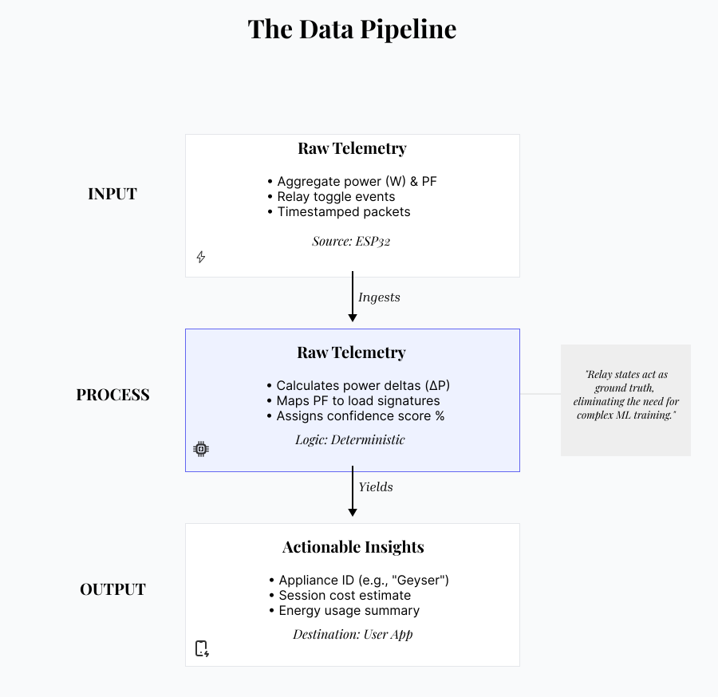
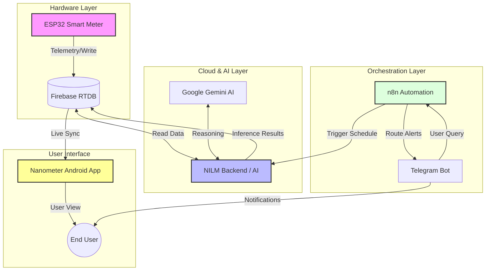

# ⚡ Voltra Ecosystem

[](LICENSE)
[](https://www.python.org/)
[](https://kotlinlang.org/)
[](https://www.arduino.cc/)
[](https://firebase.google.com/)

**The AI-Native Smart Energy & NILM Solution (2025–2026)**

<div align="center">
  
</div>

## 📋 Table of Contents
- [🚀 5-Minute Quick Start](#-5-minute-quick-start)
- [📖 Project Overview](#-project-overview)
- [🏗️ System Architecture](#️-system-architecture)
- [📦 Ecosystem Repositories](#-ecosystem-repositories)
- [⚡ Quick Start (Choose Your Entry Point)](#-quick-start-choose-your-entry-point)
- [🧩 Component Breakdown](#-component-breakdown)
- [🚀 Deployment Strategy](#-deployment-strategy)
- [📊 System Performance](#-system-performance)
- [🔧 Development & Contributing](#-development--contributing)
- [❓ FAQ & Troubleshooting](#-faq--troubleshooting)
- [👥 Author](#-author)

## 🚀 5-Minute Quick Start

Want to see Voltra in action without hardware?

**[Watch Demo Video](https://youtu.be/PBjG3P48qM4)** - See Voltra in action (5-minute walkthrough)

1. **Clone this repo**: `git clone https://github.com/Itsamnn/voltra-ecosystem`
2. **Start demo environment**: `npm run dev` (Docker Compose spins up NILM + sample data)
3. **View dashboard**: Open mobile app simulator to see mock energy data

See [QUICKSTART.md](QUICKSTART.md) for detailed steps.

## 📖 Project Overview

Voltra is a comprehensive, end-to-end IoT solution designed for Non-Intrusive Load Monitoring (NILM) and smart energy management. By combining deterministic hardware sensing with cloud-native AI, Voltra disaggregates total energy consumption into individual appliance usage without requiring complex wiring at the device level. 

The ecosystem spans four distinct repositories, orchestrating data from the electrical socket to the user's pocket.

## 🏗️ System Architecture

The system uses a **Layered Architecture** with **Event-Driven Communication**:

- **Hardware Layer** (ESP32): Energy acquisition and appliance control
- **Analytics Layer** (NILM): Intelligence and disaggregation algorithms  
- **Orchestration Layer** (n8n): Scheduling, routing, and automation
- **Application Layer** (Nanometer): User interface and visualization

Communication flows through **Firebase Realtime Database** as the central event hub.

<div align="center">
  
</div>



## ⚡ Quick Start (Choose Your Entry Point)

### I want to...
- **🔍 Monitor energy in real-time** → Start with [voltra-nanometer](https://github.com/Itsamnn/voltra-nanometer)
- **🧠 Understand appliance usage (NILM)** → Start with [voltra-nilm](https://github.com/Itsamnn/voltra-nilm)
- **🔌 Set up hardware metering** → Start with [voltra-esp32](https://github.com/Itsamnn/voltra-esp32)
- **⚙️ Automate workflows** → Start with [voltra-n8n](https://github.com/Itsamnn/voltra-n8n)

### For Full-Stack Setup
Follow the [Deployment Strategy](#-deployment-strategy) section below.

## 📦 Ecosystem Repositories

This project is divided into four specialized components. Click the links below to navigate to specific implementations.

| Component | Repository Name | Tech Stack | Status | Link |
|-----------|----------------|------------|--------|------|
| 🔌 **Hardware** | Voltra-esp32 | C++ Arduino, PZEM, GSM | 📖 Public | [View Repo](https://github.com/Itsamnn/voltra-esp32) |
| 🧠 **Intelligence** | Voltra-nilm | Python FastAPI, NILM, AI | 📖 Public | [View Repo](https://github.com/Itsamnn/voltra-nilm) |
| ⚙️ **Orchestration** | Voltra-n8n | n8n Workflows, Telegram | 📖 Public | [View Repo](https://github.com/Itsamnn/voltra-n8n) |
| 📱 **Mobile App** | Voltra-nanometer | Kotlin Android, Dashboard | 📖 Public | [View Repo](https://github.com/Itsamnn/voltra-nanometer) |

## 🧩 Component Breakdown

### 1. 🔌 Hardware: Voltra-esp32

<div align="center">
  
</div>

- **Role**: The sensory nervous system
- **Function**: PZEM metering, relay control, GSM integration for remote monitoring
- **Key Feature**: Real-time energy measurement with appliance control capabilities
- **Technology**: C++ Arduino framework with GSM communication

### 2. 🧠 Intelligence: Voltra-nilm

<div align="center">
  
</div>

- **Role**: The brain
- **Function**: NILM inference, appliance analytics, and AI advisory system
- **Key Feature**: Advanced energy disaggregation with intelligent recommendations
- **Technology**: Python FastAPI with Gemini AI Agent-powered NILM algorithms

### 3. ⚙️ Orchestration: Voltra-n8n

- **Role**: The conductor
- **Function**: Scheduling, data routing, and Telegram orchestration
- **Workflows**:
  - **Automated Scheduling**: Manages data collection and processing workflows
  - **Telegram Integration**: Provides conversational interface for system control
- **Technology**: n8n workflow automation with custom integrations

### 4. 📱 Interface: Voltra-nanometer

<div align="center">
  
</div>

- **Role**: The user interface
- **Function**: User dashboard with real-time monitoring and appliance control
- **Key Feature**: Comprehensive energy visualization and smart home control
- **Technology**: Kotlin Android with modern UI components

## 🚀 Deployment Strategy

To deploy the full ecosystem, follow this strict order of operations:

### Prerequisites
- Firebase account with RTDB enabled
- Google Cloud account with Gemini AI API access
- n8n instance (cloud or self-hosted)
- Android development environment

### Deployment Steps

1. **🔥 Firebase Setup**
   ```bash
   # Initialize Firebase project
   firebase init database
   # Generate serviceAccount.json for backend access
   ```

2. **🧠 Deploy Voltra-nilm Backend**
   ```bash
   git clone https://github.com/Itsamnn/voltra-nilm
   cd voltra-nilm
   docker build -t voltra-nilm .
   docker run -p 8000:8000 -e FIREBASE_PROJECT_ID=your_project voltra-nilm
   ```

3. **🔌 Flash ESP32 Firmware**
   ```bash
   git clone https://github.com/Itsamnn/voltra-esp32
   cd voltra-esp32
   # Configure WiFi, GSM, and Firebase credentials in config.h
   # Flash firmware to ESP32 device with PZEM integration
   ```

4. **⚙️ Setup n8n Workflows**
   ```bash
   git clone https://github.com/Itsamnn/voltra-n8n
   cd voltra-n8n
   # Import workflow JSON files to your n8n instance
   # Configure HTTP endpoints and Telegram integration
   ```

5. **📱 Build Android App**
   ```bash
   git clone https://github.com/Itsamnn/voltra-nanometer
   cd voltra-nanometer
   ./gradlew assembleRelease
   ```

> **Note**: Detailed setup instructions are available in the README.md of each respective repository.

## 📊 System Performance (Measured)

| Metric | Value | Notes |
|--------|-------|-------|
| **Real-time Latency** | < 100ms | Firebase → App pipeline |
| **Energy Accuracy** | 85-95% | NILM disaggregation (appliance-dependent) |
| **App Response Time** | < 2s | Live data refresh over WiFi |
| **NILM Processing** | ~5s | Per 15-min energy window |
| **Report Generation** | 30s | Daily summary computation |

**Test Results**: See [docs/PERFORMANCE.md](docs/PERFORMANCE.md) for detailed benchmarks.

## 🔧 Development & Contributing

### Local Development Setup
```bash
# Clone the umbrella repository
git clone https://github.com/Itsamnn/voltra-ecosystem
cd voltra-ecosystem

# Initialize all submodules
git submodule update --init --recursive

# Follow individual repo setup instructions
```

### Architecture Principles
- **Separation of Concerns**: Each component has a single responsibility
- **Event-Driven Communication**: Components communicate via Firebase events
- **Scalable Design**: Layered architecture allows independent scaling
- **AI-First Approach**: Custom NILM algorithms for energy insights

## 🤝 Contributing

Contributions are welcome! Please see [CONTRIBUTING.md](CONTRIBUTING.md) for guidelines.

**Quick contribution areas:**
- Add support for new energy sensors (currently PZEM only)
- Improve NILM accuracy for specific appliances
- Expand to other geographic tariff models

## ❓ FAQ & Troubleshooting

**Q: Do I need all 4 components?**
- No! Run just the app + NILM backend for testing without hardware.

**Q: Can I use this with my existing smart meter?**
- Yes. Modify the ESP32 firmware to read your meter protocol (Modbus, IEC-62056-21, etc.). See [voltra-esp32 README](https://github.com/Itsamnn/voltra-esp32#hardware-requirements) for sensor integration guide.

**Q: What happens if Firebase goes down?**
- Firebase is required for real-time sync. GSM provides command fallback but not data queueing. For offline resilience, implement local SPIFFS storage in ESP32 firmware (advanced feature).

**Q: How accurate is the NILM disaggregation?**
- Estimated 85-95% depending on appliance type (industry standard for NILM). High-power devices (AC, heaters) are most accurate. Detailed test results available in [docs/PERFORMANCE.md](docs/PERFORMANCE.md).

**Q: Can I run this commercially?**
- Yes! MIT license allows commercial use. See [LICENSE](LICENSE) for details.

## 📄 License

This project is licensed under the MIT License - see the [LICENSE](LICENSE) file for details.

## 👥 Author

**Aman Patel**  
*Year: 2025–2026*

---

<div align="center">
  <strong>⚡ Powering the Future of Smart Energy Management</strong>
</div>
